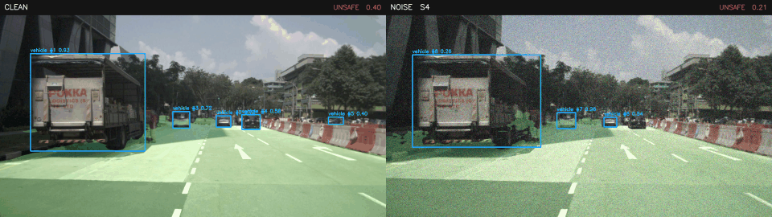
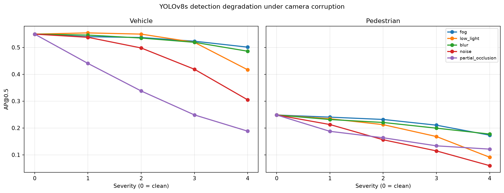
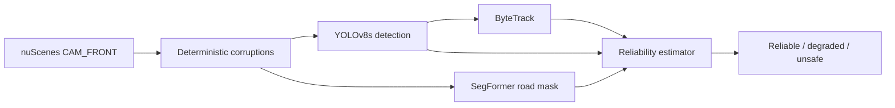

# Corruption-Aware AV Perception

A camera-only autonomous-vehicle perception pipeline that detects and tracks road users,
segments drivable space, and estimates when its own perception is no longer trustworthy.

**Project prompt:** Can I measure when an autonomous car’s vision becomes unreliable as the camera quality gets worse?

It stress-tests perception under realistic camera degradation, learns a calibrated runtime
reliability signal, and carries the same modular models from Apple Silicon development to
hardware-accelerated Linux inference.



The demo compares clean `CAM_FRONT` input with deterministic severity-4 noise. Both sides run
the real YOLOv8s detector, ByteTrack identities, SegFormer drivable-area mask, and calibrated
reliability estimator. The displayed state is not curated: occasional counterintuitive labels
are retained because reliability generalization—especially to unseen conditions—is a documented
limitation rather than something the visualization should hide.

Recreate it with another existing corruption by changing one flag:

```bash
render-demo --corruption fog  # fog, low_light, blur, noise, or partial_occlusion
```

## Results at a glance

| Result | Measured value |
|---|---:|
| Detection, Apple MPS, 404 frames | 40.03 FPS end-to-end |
| Reliability, held-out scenes | AUROC 0.709; false-safe rate 0.014 |
| YOLOv8s TensorRT FP16, Tesla T4 | 3.11 ms mean; 321.17 FPS |
| SegFormer-B0 TensorRT FP16, Tesla T4 | 3.19 ms mean; 313.58 FPS |



AP@0.5 falls under every severity-4 corruption, with noise and partial occlusion causing the
largest degradation. Values are the mean of vehicle and pedestrian AP over all 404 mini frames.

| Corruption | Clean mAP | Severity-4 mAP | Change |
|---|---:|---:|---:|
| Fog | 0.399 | 0.337 | −15.5% |
| Low light | 0.399 | 0.254 | −36.3% |
| Blur | 0.399 | 0.332 | −16.9% |
| Noise | 0.399 | 0.182 | −54.3% |
| Partial occlusion | 0.399 | 0.155 | −61.2% |



TensorRT figures are model-only, batch-1, device-resident timings. They exclude camera decode,
pre/postprocessing, tracking, and reliability estimation and are not full-pipeline FPS.

## Technology stack

| Area | Technologies used |
|---|---|
| Core ML | Python 3.11, PyTorch, TorchVision, Ultralytics YOLOv8s |
| Perception | OpenCV, SegFormer-B0, ByteTrack, Hugging Face Transformers |
| Data and evaluation | nuScenes devkit, NumPy, pandas, scikit-learn, SciPy |
| Portability | ONNX, ONNX Runtime, modular detector/segmenter/tracker interfaces |
| Acceleration | Apple Metal/MPS, CUDA 12.8, TensorRT FP16 |
| Platforms | macOS on Apple Silicon, Ubuntu 24.04, Kaggle Linux GPU runtime |
| Quality | pytest, Ruff, deterministic seeded benchmarks, Git/GitHub |

The implementation is primarily Python with reproducible shell tooling. C++17, ROS, LiDAR,
radar, SLAM, mapping, and sensor fusion are intentionally outside this project's scope.

## Milestone 1: inspect nuScenes mini

The dataset inspector loads a real nuScenes `CAM_FRONT` keyframe, projects its 3D annotations into
the calibrated camera image, and reports the scene/sample/sample-data relationships. Setup,
download, and inspector commands are collected in [Reproduce](#reproduce).

## Dataset vocabulary

- **Scene:** one roughly 20-second driving sequence.
- **Sample:** one annotated keyframe, normally spaced about 0.5 seconds apart.
- **Sample data:** a sensor observation associated with a sample, such as `CAM_FRONT`.
- **Sample annotation:** a labeled 3D object instance at one sample.
- **Instance:** the same physical object across samples in a scene.

nuScenes annotations are 3D boxes in the global coordinate system. The devkit transforms them
into the selected camera coordinate system and projects them using that camera's calibration.

## Repository layout

```text
src/av_perception/data/   Dataset loading and inspection
tests/                    Fast unit tests that do not require the dataset
outputs/                  Generated user-facing images and reports
```

## Milestone 2: object detection

Milestone 2 evaluates pretrained **YOLOv8s** COCO weights on nuScenes `CAM_FRONT`
keyframes. The detector is isolated behind an `ObjectDetector.predict_batch()` interface;
the dataset adapter, IoU matching, metrics, CSV writing, and visualization code do not import
Ultralytics. A later ONNX Runtime or TensorRT backend can therefore implement the same interface.

### Class mapping

| COCO class | COCO ID | Evaluation class |
|---|---:|---|
| person | 0 | pedestrian |
| car | 2 | vehicle |
| bus | 5 | vehicle |
| truck | 7 | vehicle |

Comparable nuScenes ground truth is mapped from `vehicle.car`, `vehicle.truck`,
`vehicle.bus.*`, and `human.pedestrian.*`. Bicycle, motorcycle, trailer, construction,
emergency, and other categories are excluded because they do not correspond exactly to the
requested COCO mapping.

### Ground-truth filtering

The default evaluator excludes:

- annotations with nuScenes visibility below `2` (less than approximately 40% visible);
- projected boxes smaller than `400 px²` after clipping to the camera image.

These thresholds are configurable with `--min-visibility` and `--min-box-area`. The defaults
reduce ambiguous, heavily occluded, and extremely small targets while preserving challenging
objects. Matching is greedy, class-aware, one-to-one, and uses IoU `>= 0.5` by default.

Exact default evaluation configuration:

| Setting | Value |
|---|---:|
| Detector confidence threshold | 0.25 |
| Match IoU threshold | 0.50 |
| Minimum nuScenes visibility token | 2 |
| Minimum clipped projected-box area | 400 px² |
| Inference image size | 640 px |

Ground-truth 3D boxes are transformed by the nuScenes devkit into `CAM_FRONT` camera
coordinates, projected with the calibrated camera intrinsic matrix, converted to the min/max
axis-aligned 2D rectangle, clipped to the image, then filtered. Predictions are sorted by
descending confidence and greedily assigned to the highest-IoU unmatched GT of the same mapped
class. A prediction is a true positive only when that IoU is at least 0.50; remaining predictions
are false positives and remaining GT boxes are false negatives.

AP uses an all-points interpolated precision-recall integral: predictions are confidence-ranked,
cumulative precision and recall are calculated, the precision envelope is made monotonically
non-increasing, and area is summed at each recall change. Reported mAP is the arithmetic mean of
vehicle AP and pedestrian AP. This is AP@0.5 for this project-specific filtered two-class task,
not nuScenes' official center-distance detection metric and not COCO AP@[.5:.95].

### Run the evaluator

```bash
source .venv/bin/activate

# Pilot on the first three scenes.
evaluate-detection \
  --dataroot data/nuscenes \
  --output-dir outputs/milestone2/pilot \
  --scenes 3 \
  --device mps

# Full nuScenes mini split (all ten scenes).
evaluate-detection \
  --dataroot data/nuscenes \
  --output-dir outputs/milestone2/full \
  --device mps
```

Each run writes:

- `detections.csv`: one long-form file containing detection and filtered-ground-truth rows;
- `metrics.json`: configuration, runtime, precision, recall, and AP per class;
- `visualizations/*.jpg`: green GT boxes, blue matched predictions, and red unmatched predictions.

The CSV retains scene/frame/sample identity, image path, normalized class, original source class,
confidence, coordinates, IoU, match status, annotation token, and visibility. This is the stable
schema that later corruption and reliability experiments will reuse.

Measured on all 404 nuScenes mini `CAM_FRONT` keyframes with batch size 8 (end-to-end evaluator
timing, including image loading, inference, projection/matching, and selected visualizations):

| Device | Total time | Latency/frame | Throughput |
|---|---:|---:|---:|
| CPU | 20.90 s | 51.73 ms | 19.33 FPS |
| Apple MPS | 10.09 s | 24.98 ms | 40.03 FPS |

MPS produced the same detection counts and matching results as CPU, with approximately 2.07×
higher end-to-end throughput.

### Ultralytics license

Ultralytics YOLO and its pretrained weights are distributed under the **AGPL-3.0 license** unless
a separate Ultralytics Enterprise license applies. This repository's use of the Ultralytics
package must comply with those terms. Review licensing before redistribution, network service
deployment, or commercial use. The backend boundary also allows replacement with a differently
licensed detector if required.

## Milestones 5–6: corruption engine and failure benchmark

The corruption benchmark applies five deterministic camera corruptions at severities 1–4.
Every stochastic transform derives its random generator from the configured base seed, sample
token, corruption name, and severity, so a specific corrupted frame is exactly reproducible.

| Corruption | Severity 1 → 4 parameterization |
|---|---|
| Fog | spatial haze alpha 0.16, 0.30, 0.45, 0.60 |
| Low light | exposure scale 0.62, 0.44, 0.29, 0.17 with increasing gamma |
| Blur | Gaussian kernels 5, 9, 15, 23 pixels |
| Noise | Gaussian sigma 8, 16, 28, 42 intensity levels |
| Partial occlusion | seeded near-black rectangle covering 8%, 16%, 28%, 40% |

Run a two-scene pilot or all ten mini scenes:

```bash
benchmark-corruptions \
  --dataroot data/nuscenes \
  --output-dir outputs/milestone56/pilot \
  --scenes 2 \
  --device mps \
  --seed 20261006

benchmark-corruptions \
  --dataroot data/nuscenes \
  --output-dir outputs/milestone56/full \
  --device mps \
  --seed 20261006
```

Each benchmark writes one `detections.csv` containing clean and corrupted rows with `corruption`,
`severity`, and per-frame `seed` columns, plus `metrics.json` and `ap_vs_severity.png`. Corrupted
frames are generated batch-by-batch in memory instead of permanently duplicating the dataset.

## Milestone 3: drivable-area segmentation

nuScenes does not provide per-pixel drivable-area labels for camera images. Segmentation IoU here
therefore measures consistency between each corrupted frame's predicted mask and the clean frame's
predicted mask. It measures robustness under corruption, not segmentation accuracy. Qualitative
inspection of clean masks is reported separately and is not presented as ground-truth validation.

The implementation uses `nvidia/segformer-b0-finetuned-cityscapes-1024-1024` and extracts the
Cityscapes `road` class as a drivable-area proxy. The segmenter is wrapped behind
`Segmenter.segment_batch()`, which accepts paths or in-memory arrays and returns boolean masks at
the source resolution. This keeps the benchmark independent of PyTorch and permits future ONNX or
TensorRT backends.

For each frame, the clean predicted mask is the reference. The same frame is then processed under
all five deterministic corruptions at severities 1–4. The reported metric is binary mask IoU:
`intersection(clean, corrupted) / union(clean, corrupted)`. Results include per-frame IoU plus
per-condition mean, median, and 10th-percentile IoU. An empty clean mask and empty corrupted mask
receive IoU 1.0 because they agree, though clean-mask visualizations should be inspected to catch
consistently empty or implausible outputs.

```bash
# Two-scene pilot.
benchmark-segmentation \
  --dataroot data/nuscenes \
  --output-dir outputs/milestone3/pilot \
  --scenes 2 \
  --device mps

# Full ten-scene mini dataset.
benchmark-segmentation \
  --dataroot data/nuscenes \
  --output-dir outputs/milestone3/full \
  --device mps
```

Each run writes `segmentation_consistency.csv`, `metrics.json`, clean-mask qualitative overlays,
and `mask_iou_vs_severity.png`.

## Milestone 4: object tracking

Tracking uses the established Ultralytics implementation of **ByteTrack**, fed by the normalized
YOLOv8s vehicle/pedestrian detections. It is wrapped behind `MultiObjectTracker`, so the association
backend can be replaced later without changing evaluation or nuScenes loading. The tracker is reset
at each scene boundary and for every corruption/severity condition. The dependency and inherited
Ultralytics components are AGPL-3.0 licensed, as noted above.

The primary experiment deliberately uses annotated nuScenes CAM_FRONT keyframes. These are sampled
at approximately **2 Hz**, so an object can move substantially during the roughly 0.5 seconds
between evaluated frames. ByteTrack is normally used on much denser video and this sparse sampling
makes motion prediction and IoU association unusually difficult. The reported values are therefore
a constrained keyframe experiment and must not be presented as production-rate tracking results.
nuScenes camera sweeps could provide denser temporal input, but they do not have the same keyframe
annotation setup; they are excluded from the primary evaluation for now.

Ground-truth identities come directly from nuScenes `instance_token` values. The same visibility
(`>= 2`), projected-area (`>= 400 px²`), class mapping, detector confidence (`>= 0.25`), and
class-aware IoU matching threshold (`0.5`) used by detection evaluation apply here. ByteTrack uses
high/new-track thresholds `0.25`, low threshold `0.1`, match threshold `0.8`, score fusion, and a
six-keyframe track buffer. Tracking is restarted per scene.

Metrics are defined as follows:

- **IDF1:** a global Hungarian assignment maximizes matched frame observations between nuScenes
  instance tokens and scene-scoped predicted track IDs. `IDTP` is the assigned overlap count,
  `IDFN = GT observations - IDTP`, `IDFP = predicted observations - IDTP`, and
  `IDF1 = 2*IDTP / (2*IDTP + IDFP + IDFN)`.
- **ID switches:** a ground-truth identity is matched to a different predicted ID than at its
  previous matched observation.
- **Fragmentations:** a matched ground-truth identity becomes unmatched for one or more evaluated
  observations and is later matched again.
- **Observation retention:** matched filtered GT observations divided by all filtered GT
  observations. Mean identity retention averages that ratio per nuScenes instance.

Raw switch and fragmentation counts can decrease under severe corruption simply because the
detector returns too few tracks to switch. Interpret them together with IDF1 and retention, not as
standalone evidence that severe corruption improves tracking.

```bash
# Two-scene pilot, followed by all ten mini scenes after validation.
benchmark-tracking \
  --dataroot data/nuscenes \
  --output-dir outputs/milestone4/pilot \
  --scenes 2 \
  --device mps \
  --seed 20261006

benchmark-tracking \
  --dataroot data/nuscenes \
  --output-dir outputs/milestone4/full \
  --device mps \
  --seed 20261006
```

Each run writes `tracking_results.csv`, `metrics.json`, representative clean tracking overlays, and
`tracking_vs_severity.png`. The CSV contains scene/frame, corruption/severity/seed, predicted track
IDs, nuScenes instance tokens, boxes, IoU, match status, and linked predicted/ground-truth identity.

## Milestone 7: runtime perception reliability

The runtime estimator returns a calibrated probability that the current perception output is
acceptable, then maps it to `reliable` (`score >= 0.8`), `degraded` (`0.5 <= score < 0.8`), or
`unsafe` (`score < 0.5`). It is a class-balanced logistic model with held-out isotonic calibration
and a conservative training-distribution guard that prevents clearly out-of-distribution feature
vectors from being labeled reliable.

Runtime inputs are limited to signals available without ground truth: brightness/contrast/dark and
bright pixel fractions, sharpness, edge density, saturation, detection counts/confidences, class
counts, predicted road fraction, track counts/confidence, and track-ID continuity. Corruption name,
severity, GT matches, segmentation consistency against a clean frame, and nuScenes identities are
**not** model inputs.

Offline supervision defines per-frame perception quality as
`0.45 * detection F1 + 0.25 * segmentation consistency + 0.30 * tracking recall`; quality `>= 0.6`
is acceptable. This label supports the controlled corruption study but inherits the segmentation
self-consistency limitation described above and is not a real-world safety certification.

Scenes are kept disjoint: six train scenes, one calibration scene, and three test scenes. In
addition to the all-corruption held-out-scene test, each corruption family is excluded completely
from training/calibration and evaluated on that family in held-out scenes. Reported metrics are
AUROC, precision-recall average precision, Brier score, expected calibration error (10 bins), and
false-safe rate (the fraction of unacceptable examples assigned the `reliable` state).

```bash
evaluate-reliability \
  --detection-csv outputs/milestone56/full/detections.csv \
  --segmentation-csv outputs/milestone3/full/segmentation_consistency.csv \
  --tracking-csv outputs/milestone4/full/tracking_results.csv \
  --output-dir outputs/milestone7/full
```

The full experiment contains 8,484 examples. On held-out scenes it achieved AUROC `0.709`,
precision-recall AP `0.280`, Brier score `0.192`, ECE `0.205`, and false-safe rate `0.014`.
Leave-one-corruption-out results are substantially weaker. In particular, unseen fog produced a
false-safe rate of `0.507`; unseen noise was caught by the distribution guard but had AUROC `0.514`.
These are reported as limitations, not hidden: broader training corruption coverage and better
uncertainty modeling are required before treating the score as a safety mechanism.

## Milestone 8: reproducible Ubuntu environment

Ubuntu setup is automated separately from macOS so platform-specific virtual environments cannot
overwrite each other:

```bash
./scripts/setup_ubuntu.sh
./scripts/validate_ubuntu.sh
```

The setup installs required apt packages, Linux-native `uv`, Python 3.11, official CPU-only PyTorch
wheels for non-NVIDIA machines, and the project into `.venv-linux`. The validator checks the actual
Linux kernel/distribution, runs Ruff and pytest, and executes `--help` for every project CLI.

This workflow was executed—not merely authored—in a free local Ubuntu 24.04.4 LTS ARM64 Lima VM:
Linux kernel 6.8.0, Python 3.11.17, 39 passing tests, successful Ruff validation, and all seven CLI
entry points loading successfully. See `deploy/ubuntu/README.md`. CUDA/TensorRT results are not
claimed from this CPU-only VM.

## Milestone 9: hardware-accelerated deployment

Install the deployment extra and export both perception models:

```bash
uv pip install -e '.[deployment]'
export-onnx --output-dir outputs/milestone9/onnx
```

The real YOLOv8s and SegFormer-B0 graphs were exported, checked with `onnx.checker`, and executed
through ONNX Runtime. YOLO input `images` produces `[1, 84, 8400]`; SegFormer input `pixel_values`
produces `[1, 19, 128, 128]`.

Final validation used one of two free Kaggle Tesla T4 GPUs (`CUDA_VISIBLE_DEVICES=0`). The installed
toolkit was CUDA 12.8 (`nvcc V12.8.93`); CUDA 13.0 from `nvidia-smi` is the driver's compatibility
level, not the installed toolkit. The run used driver 580.178.04, PyTorch 2.11.0+cu128, cuDNN
9.19, TensorRT 10.13.3.9, and ONNX Runtime GPU 1.22.0.

Both models built as real FP16 TensorRT engines with dynamic batch profiles 1–8. TensorRT timings
use batch 1, seeded FP32 input, 50 warm-up iterations, and 200 synchronized measured iterations
with device-resident I/O. ONNX Runtime uses 20 warm-up and 100 measured `session.run` calls and
includes host/device transfers; its zero-copy I/O binding path aborted in Kaggle, so these backend
timings are informative but not perfectly equivalent.

| Model | Backend | Precision | Input | Mean | p95 | Throughput |
|---|---|---|---|---:|---:|---:|
| YOLOv8s | TensorRT | FP16 | 1×3×640×640 | 3.114 ms | 3.180 ms | 321.17 FPS |
| YOLOv8s | ONNX Runtime CUDA | FP32 | 1×3×640×640 | 12.091 ms | 12.305 ms | 82.71 FPS |
| SegFormer-B0 | TensorRT | FP16 | 1×3×512×512 | 3.189 ms | 3.234 ms | 313.58 FPS |
| SegFormer-B0 | ONNX Runtime CUDA | FP32 | 1×3×512×512 | 13.622 ms | 13.896 ms | 73.41 FPS |

FP16 TensorRT closely matched FP32 ONNX Runtime CUDA on identical inputs: relative L2 error was
`7.57e-4` for YOLOv8s and `1.70e-3` for SegFormer, with cosine similarity above `0.999999` for
both. YOLO's largest absolute raw-output difference was 5.97 because its output contains
pixel-scale box coordinates; mean absolute difference was 0.00605.

TensorRT engine creation and CUDA execution are measured facts. Nsight Systems profiling is not:
the Kaggle image lacked `nsys`, so the prepared command could not run. Full pipeline profiling,
representative-frame task-level equivalence after postprocessing, and production GPU deployment
remain future work. Exact hashes, percentiles, and methodology are stored in
`deploy/cuda/kaggle_t4_validation.json`.

## Reproduce

### macOS environment

On Apple Silicon, the bootstrap script installs `uv`, Python 3.11, and project dependencies into
the local `.venv`; it does not require Homebrew or modify shell profiles.

```bash
sh scripts/bootstrap_macos.sh
source .venv/bin/activate
python --version
pytest -q
```

### nuScenes mini

Create a nuScenes account, download **v1.0-mini**, and extract it so the supplied `--dataroot`
contains both `samples/` and `v1.0-mini/`:

```text
data/nuscenes/
├── maps/
├── samples/
├── sweeps/
└── v1.0-mini/
```

The dataset and archives are ignored by Git. A `data/nuscenes` symlink is also supported.

### Inspect and validate

```bash
inspect-nuscenes \
  --dataroot data/nuscenes \
  --output outputs/nuscenes_cam_front.png

pytest -q
ruff check .
```

The inspector uses the first sample by default. Use `--sample-token <TOKEN>`, `--channel`,
`--all-annotations`, or `--show` for targeted and interactive inspection. Each milestone section
above includes its corresponding pilot and full-dataset commands.
